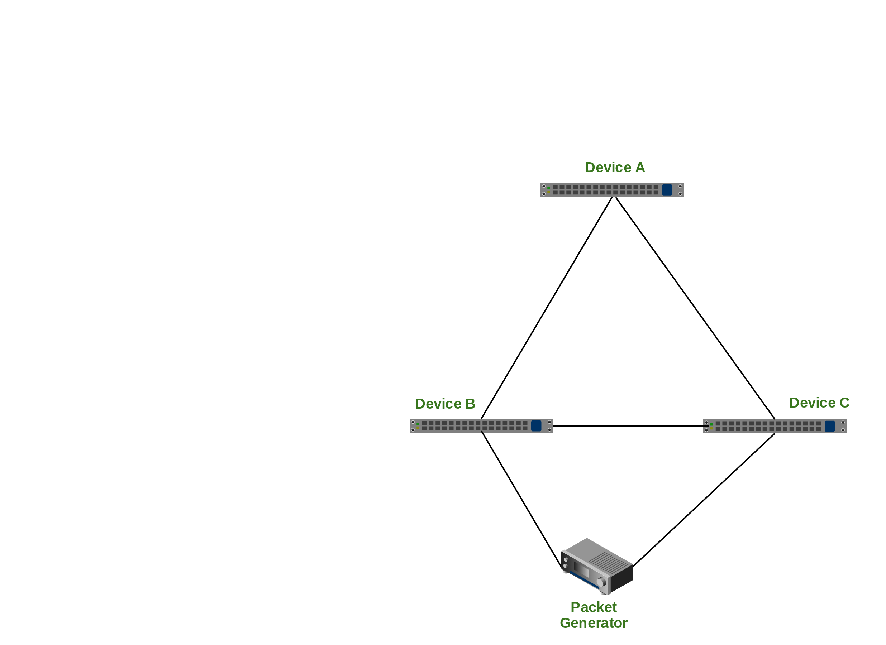

# Chaos Honey badger

Chaos Honey badger randomly breaks link in a network. This will test the network resiliency
and convergence times.

####Goal :
   
Goal of this test is to make sure the network reacts in a reasonable manner for constant network changes.
Quite possibly evaluate our performance against existing vendors.

#### Network Setup:

The following diagram depicts the network topology. As shown there are three devices A,B,C are  connected in a triangle.
There is a traffic generator that sends full line rate, bidirectional traffic between A, C. The test script breakLinks.py located under tests
does the following

- For each port in the network break the link randomly
- Wait for 10 sec
- Bring up the link back 

#### Results :

Coming soon
This project is clone from https://github.com/OpenSnaproute/chaoshoneybadger.git 
This project is only for learing purpose.
This project is assumed to be changed by a program. 
DONOT CHECKOUT OR CLONE THIS PROJECT
